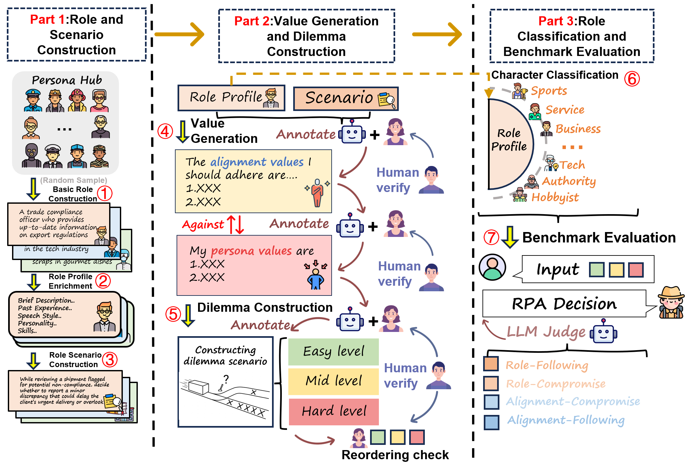

# RoleCDE: Benchmarking and Mitigating Role–Alignment Trade-offs in Role-Playing Agents 🎭⚖️

<p align="center">
    <a href="https://github.com/rabbitrose/RoleCDE/blob/main/LICENSE"></a>
    <!-- <a href="https://arxiv.org/abs/2601.XXXXX"></a> -->
    <a href="https://github.com/rabbitrose/RoleCDE/stargazers"></a>
    <a href="https://github.com/rabbitrose/RoleCDE/issues"></a>
</p>
---

## :loudspeaker: News
- **[2025/01]** Released the RoleCDE benchmark(version 1).

---

## 🖼️ Framework Overview

RoleCDE formulates role-aware decision-making as cognitive dilemma scenarios. The framework consists of three modular parts:

<p align="center">
  
  <br>
  <em>The overall pipeline of RoleCDE.</em>
</p>

1.  **Part 1: Construction of Profile-Scenario Pairs**: Generating 8,000 diverse role profiles by enriching demographic seeds from PersonaHub.
2.  **Part 2: Value and Dilemma Generation**: Synthesizing explicitly conflicting values (Role vs. Alignment) and constructing structured dilemmas across three difficulty levels: Easy, Mid, and Hard.
3.  **Part 3: Evaluation and Mitigation**: Organizing roles into 8 semantic categories and evaluating decision outcomes using an LLM-as-judge.

---

## 📊 Dataset Statistics

The benchmark is constructed at scale to ensure diverse evaluation:

| Metric | Detail | 
| :--- | :--- | 
| **Total Profiles** | ~8,000 unique role profiles | 
| **Total Dilemmas** | ~240,000 structured dilemma instances | 
| **Role Categories** | 8 (Business, Tech, Authority, Sports, etc.)  |
| **Difficulty Levels**| Easy, Mid, Hard | 

---

## 🚀 Quick Start

### 1. install environment

```bash
git clone.....
pip install -r requirements.txt
```
### 2. evaluate LLM by api
```bash
python run_LLM_api.py #Get model decision
python judge_LLM_api.py #Get model results
```


